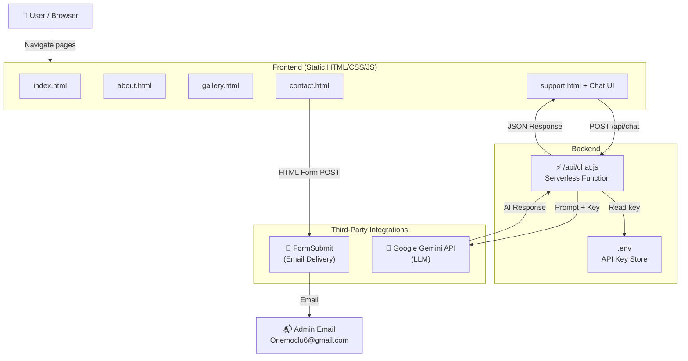
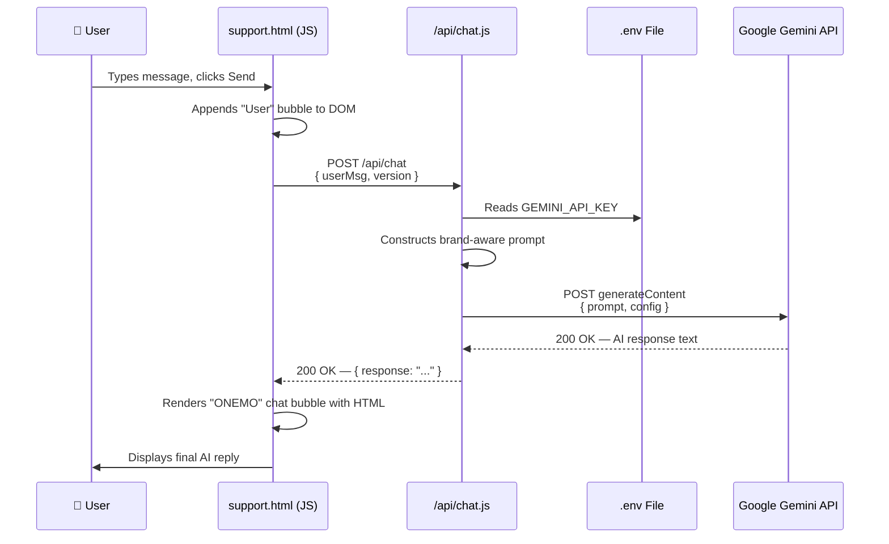
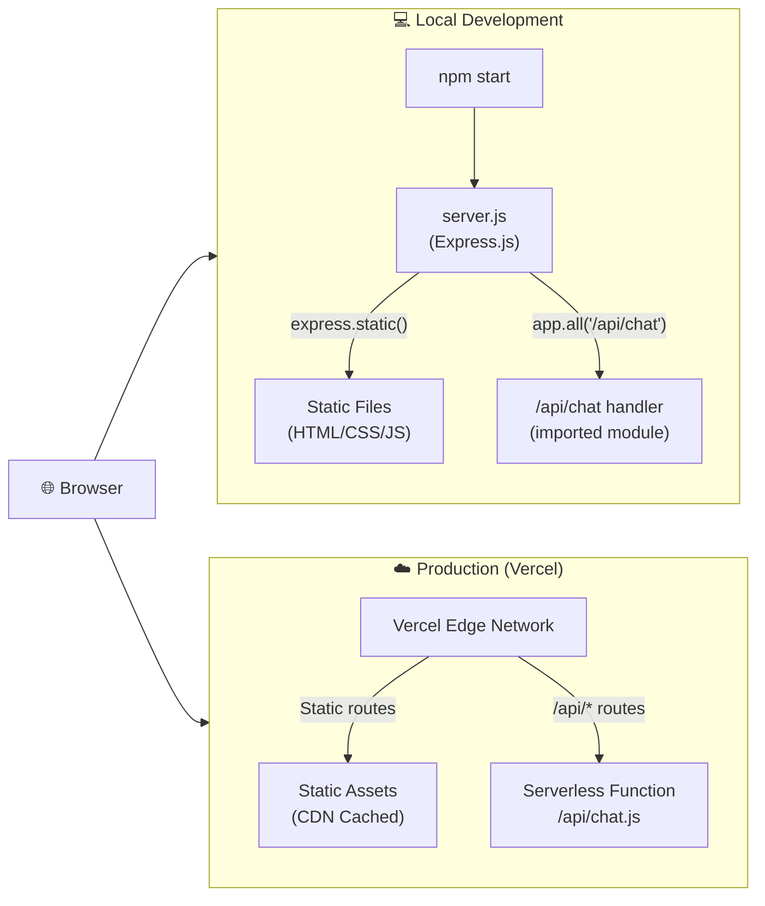
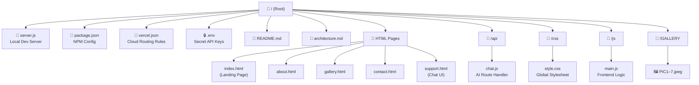
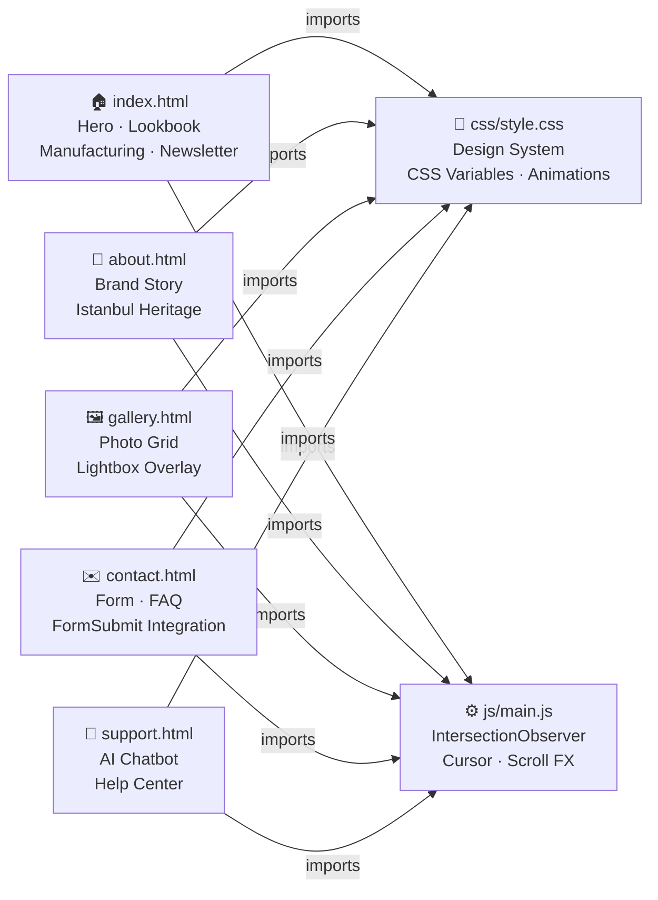
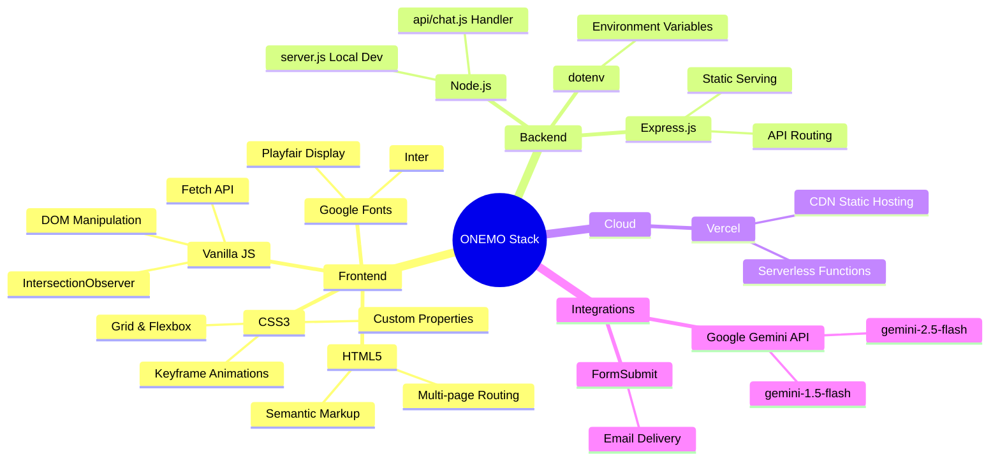

# System Architecture

The ONEMO platform is engineered as a decoupled, hybrid architecture combining a static frontend with a serverless backend. This ensures maximum page delivery speed while retaining dynamic data processing capabilities.

---

## 1. High-Level System Overview

---

## 2. AI Chatbot Data Flow

---

## 3. Local vs Production Routing

---

## 4. Directory Structure

---

## 5. Frontend Page Architecture

---

## 6. Tech Stack Overview

